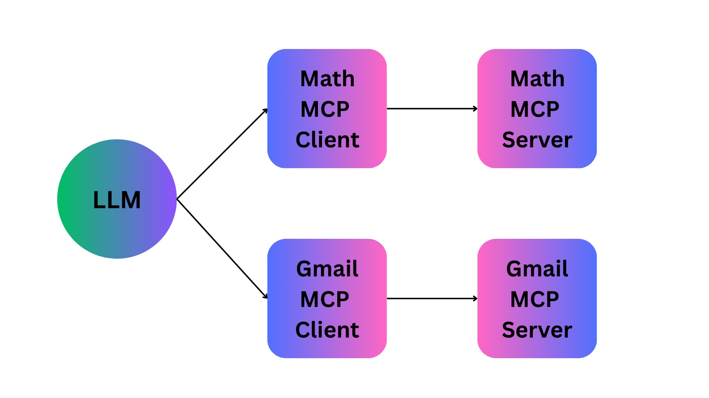

# 🧠 MCP Learning Project – Model Context Protocol Integration Demo

This project is a hands-on exploration of the [Model Context Protocol (MCP)](https://github.com/modelcontextprotocol) — an open protocol that allows LLM applications to seamlessly interact with external tools and data sources. The goal of this codebase is to demonstrate how to integrate a variety of tools, both modern and legacy, into an LLM workflow using MCP.

## 🔧 What’s Inside

The project showcases three types of tool integrations:

- 🧮 Math Tools

   Simple Python functions for basic mathematical operations.

- 🎨 Native Drawing Tools (Non-API / Legacy Integration)

   Leverages AppleScript to control native macOS applications like Keynote, enabling the LLM to draw or write on a slide. This demonstrates how MCP can bridge the gap between LLMs and non-API, native desktop tools.

- 📧 API-Based Tools

   Integration with tools like Gmail, showcasing how MCP handles modern API-based service interactions.

## 💡 Purpose

This project serves as a learning ground for:

- Understanding MCP in action
- Experimenting with tool integrations (both legacy and modern)

- Exploring multi-client/multi-server setups with a shared LLM interface

## 🌐 Multi-Server/Client Support

The code also includes a demonstration of:

- Running two MCP servers

- Initiating two MCP clients

- Using a single LLM to communicate across both clients and interact with their respective tools.

This helps illustrate how MCP can be scaled and structured for distributed, modular architectures.



## Math Agent with Gmail Integration

A powerful Python-based math agent that combines mathematical calculations with visual presentation in Keynote and email sharing capabilities. Built using Model Control Protocol (MCP) and Google's Gemini AI.

## 🚀 Quick Start

1. **Clone and Setup**
```bash
git clone <your-repository-url>
cd keynote-drawing-text
```

2. **Install Dependencies**
```bash
pip install -r requirements.txt
```

3. **Configure Environment Variables**
   Create `.env` file with your API keys and email:
     ```
     GEMINI_API_KEY=your_api_key_here
     EMAIL_ID=your.email@example.com
     ```

4. **Run the Agent**
```bash
python mcp-client-test.py "Your math query here"
```

## ✨ Features

### Mathematical Capabilities
- Basic arithmetic operations (add, subtract, multiply, divide)
- Advanced functions (factorial, logarithms, trigonometry)
- ASCII value calculations and exponential operations
- Custom mathematical sequences and patterns

### Visual Presentation
- Automatic Keynote document creation
- Shape drawing capabilities
- Text placement and formatting
- Dynamic slide management

### Communication
- Email results via Gmail integration
- Automated result sharing
- Customizable email templates

## 🛠️ Technical Stack

- **Framework**: Model Control Protocol (MCP)
- **AI Model**: Google Gemini
- **Presentation**: Apple Keynote
- **Email**: Google Gmail API
- **Language**: Python 3.x

## 📁 Project Structure

```
.
├── mcp-client-test.py     # Main client orchestrator
├── mcp-server.py          # Math operations server
├── gmail_server_test.py   # Gmail integration
├── requirements.txt       # Dependencies
├── credentials.json       # Gmail API credentials
└── .env                   # Environment variables
```

## 🔧 API Setup

### Gemini API
1. Create a Google Cloud project
2. Enable Gemini API
3. Create API key
4. Add to `.env` file

### Gmail API Setup
1. **Create a new Google Cloud project**
   - Go to [Google Cloud Console](https://console.cloud.google.com/)
   - Create a new project or select an existing one

2. **Enable the Gmail API**
   - In the Google Cloud Console, navigate to "APIs & Services" > "Library"
   - Search for "Gmail API" and enable it

3. **Configure OAuth Consent Screen**
   - Go to "APIs & Services" > "OAuth consent screen"
   - Select "External" user type (we won't publish the app)
   - Fill in the required app information
   - Add your personal email address as a "Test user"

4. **Create OAuth Credentials**
   - Go to "APIs & Services" > "Credentials"
   - Click "Create Credentials" > "OAuth client ID"
   - Select "Desktop App" as the application type
   - Download the JSON file containing your OAuth keys
   - Rename the downloaded file to `credentials.json`
   - Place it in your project root directory

5. **Configure Environment**
   - Add your email address to the `.env` file:
     ```
     EMAIL_ID=your.email@example.com
     ```

6. **Run the Application**
   - The credentials file path will be automatically used by the application
   - First run will prompt you to authorize the application
   - A `token.json` file will be created after successful authorization

## 💡 Example Usage

```bash
python mcp-client-test.py "Find the ASCII values of characters in INDIA and then return sum of exponentials of those values"
```

If no query is provided, the script will use a default query mentioned in the above example.

The client will:
1. Automatically start the MCP server in the background
2. Perform the requested mathematical operations
3. Send results via email

## ⚙️ Available Tools

### Math Operations
```python
# Basic
add(x, y)           # Addition
subtract(x, y)      # Subtraction
multiply(x, y)      # Multiplication
divide(x, y)        # Division
power(x, y)         # Exponentiation

# Advanced
factorial(n)        # Factorial calculation
log(x)              # Natural logarithm
sin(x), cos(x)      # Trigonometric functions
strings_to_chars_to_int(s)  # ASCII conversion
```

### Keynote Tools
```python
mac_open_keynote()          # Create new presentation
mac_draw_rectangle()        # Add shape to slide
mac_add_text_in_keynote(t)  # Add text content
```

### Gmail Tools
```python
send_email(recipient, subject, message)  # Send results via email
```

## 🛡️ Error Handling

The system includes robust error handling for:
- API authentication failures
- Mathematical operation errors
- Keynote integration issues
- Email sending problems
- LLM response timeouts

## 🤝 Contributing

Contributions are welcome! Please:
1. Fork the repository
2. Create a feature branch
3. Submit a pull request
